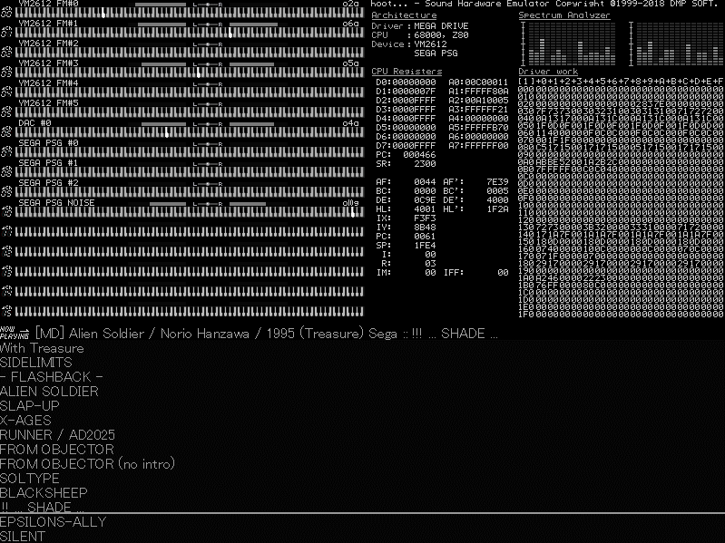

## About ##

This here is my personal <i>hoot</i> folder with my favourite video game soundtracks added in.

You can read about <i>hoot</i> here: http://vgmrips.net/wiki/Hoot

If I add anything it goes to <i>xml/\~systems\~.xml</i> which is the only xml file <i>hoot</i> reads for soundtrack entries.

## Games List ##

Arcade/Neo Geo

* 3D Outrun (3DS tracks)
* Akuma-Jou Dracula [Haunted Castle]
* Aliens
* Armed Police Batrider
* Armed Police Unit Gallop [Cosmic Cop]
* Battle Garegga
* Burning Force
* Carrier Air Wing
* Darius
* Darius II
* Daytona USA
* Dragon Saber: After Story of Dragon Spirit
* E.D.F.: Earth Defense Force
* Elevator Action Returns
* Fantasy Zone
* Fantasy Zone II DX: The Tears of Opa-Opa
* Fighting Layer
* Final Fight
* Galaxy Force II
* Garou: Mark of the Wolves
* Golgo 13: Kiseki no Dandou
* Gradius IV
* Great Sluggers '94
* Growl
* Hayaoshi Quiz Ouza Ketteisen: The King Of Quiz
* Hyper Duel
* Kaiser Knuckle
* Kart Duel
* Kingdom Grandprix [Shippu Mahou Daisakusen]
* Konami's Open Golf Championship
* Last Survivor
* Magic Sword - Heroic Fantasy
* Marvel Vs. Capcom: Clash of Super Heroes
* Metal Black
* Metal Slug
* Metal Slug 2
* Metal Slug 3
* Money Puzzle Exchanger
* Mr. Driller
* Neo Turf Masters
* Night Slashers
* Ninja Warriors, The
* OutRun
* Outfoxies, The
* Paca Paca Passion
* Prime Goal EX
* PuLiRuLa
* Puzzle Bobble
* Quartet
* Quiz Nanairo Dreams: Nijiirochou no Kiseki
* Rolling Thunder 2
* Salamander 2
* Sega Rally Championship
* Shinobi
* Soldam
* Space Harrier
* Street Fighter Alpha 2
* Sunset Riders
* Super Contra
* Super Dodge Ball
* Super Monaco GP
* Super Street Fighter II: Turbo
* Teenage Mutant Ninja Turtles - Turtles in Time
* Thunder Blade
* TwinBee Yahhoo!
* U. N. Squadron
* Under Fire
* X-Men: Children of the Atom
* Xexex

Game Boy

* Another Bible
* Batman - Return of the Joker
* Castlevania - The Adventure
* Castlevania II - Belmont's Revenge
* Castlevania Legends
* Dragon Warrior Monsters 2
* Final Fantasy Legend II [SaGa 2 - Hihou Densetsu]
* Legend of Zelda, The - Link's Awakening
* Megami Tensei Gaiden: Last Bible
* Metroid II - Return of Samus
* Pokemon Card GB: GRdan Sanjou
* Pokemon Trading Card Game
* Raging Fighter [Outburst]
* Spawn
* Star Ocean: Blue Sphere
* Super Mario Land
* Super Mario Land 2 - 6 Golden Coins
* Teenage Mutant Ninja Turtles - Fall of the Foot Clan
* Tetris
* Trip World
* X
* Xerd no Densetsu 2

Game Gear/Master System

* Devilish
* GG Aleste
* GG Aleste 2
* Sonic the HedgeHog
* Sylvan Tale
* Zillion

MSX Computers

* F1 Spirit -The Way to Formula-
* F1 Spirit 3D Special
* Final Fantasy
* Gekitotsu Pennant Race 2
* Illusion City
* Metal Gear 2: Solid Snake
* Quarth
* SD Snatcher
* Salamander
* Snatcher

MegaDrive / Genesis

* Alien 3
* Alien Soldier
* Alisia Dragoon
* Arnold Palmer Tournament Golf [Naomichi Ozaki no Super Masters]
* Battle Mania Daiginjo
* Bishoujo Senshi Sailor Moon
* Castlevania: Bloodlines [Vampire Killer]
* Chou Kyuukai Miracle Nine
* Columns III: Revenge of Columns
* Contra: Hard Corps
* Crude Buster [Two Crude]
* Crusader of Centy
* Dangerous Seed
* Devilish [Bad Omen]
* Dino Land
* Dynamite Headdy
* Fushigino Umi no Nadia
* Gaiares
* Gain Ground
* Gauntlet IV
* Ghouls 'n Ghosts
* Gley Lancer
* Golden Axe II
* Gunstar Heroes
* Gynoug [Wings of Wor]
* Hybrid Front, The
* Jewel Master
* Landstalker: The Treasures of King Nole
* Langrisser II
* Lethal Enforcers
* Light Crusader
* M.U.S.H.A
* Madou Monogatari I
* Master of Monsters
* McDonald's Treasure Land Adventure
* Mega Turrican
* Midnight Resistance
* Phantasy Star II
* Phantasy Star III
* Phantasy Star IV
* Revenge of Shinobi, The
* Ristar - The Shooting Star
* Rocket Knight Adventures
* Rolling Thunder 2
* Rolling Thunder 3
* Shadow Dancer: The Secret of Shinobi
* Shining Force II: The Ancient Seal
* Shining in the Darkness
* Shinobi III: Return of the Ninja Master
* Socket [Time Dominator 1st]
* Sonic the Hedgehog
* Sonic the Hedgehog 2
* Sonic the Hedgehog 3 & Knuckles
* Sorcerian
* Space Invaders 90
* Splatterhouse 2 // see hoot.ini for correct sample rate
* Splatterhouse 3 // see hoot.ini for correct sample rate
* Star Cruiser
* Streets of Rage [Bare Knuckle]
* Streets of Rage 2 [Bare Knuckle II]
* Strider
* Super Fantasy Zone
* Super Hang-On
* Sword of Vermilion
* Teenage Mutant Ninja Turtles: Tournament Fighters
* Thunder Force III
* Thunder Force IV
* Time Trax (Prototype)
* Valis III
* Valis: The Fantasm Soldier
* Vapor Trail
* Verytex
* Vixen 357
* Yuu Yuu Hakusho - Makyou Toitsusen
* Zero Wing

NES

* Abadox - The Deadly Inner War
* Adventure Island
* Akumajou Special - Boku Dracula-kun
* Arumana no Kiseki
* Base Wars - Cyber Stadium Series
* Batman
* Batman Returns
* Blue Marlin, The
* Castlevania
* Castlevania II - Simon's Quest
* Castlevania III - Dracula's Curse [Akumajou Densetsu]
* Chaos World
* Chip 'n Dale Rescue Rangers
* Choujin Sentai - Jetman
* Contra
* Contra Force [Ark Hound]
* Crisis Force
* Dark Lord
* Double Dragon II - The Revenge
* Dragon Fighter
* Dragon Quest
* Dragon Quest II: Luminaries of the Legendary Line
* Dragon Quest IV: Chapters of the Chosen
* Esper Dream 2
* Exciting Soccer - Konami Cup
* Falsion
* Ferrari Grand Prix Challenge
* Final Fantasy II
* Final Fantasy III
* Gimmick!
* Goonies II, The
* Gremlins 2 - The New Batch
* Gyruss
* Ivan "Ironman" Stewart's Super Off Road
* Jackal
* Jackie Chan's Action Kung-Fu
* Journey to Silius [RAF World]
* Just Breed
* Kick Master
* Kirby's Adventure
* Konami Hyper Soccer
* Kunio-kun no Nekketsu Soccer League
* Lagrange Point
* Legend of Zelda 2, The - The Adventure of Link
* Legend of Zelda, The
* Little Nemo - The Dream Master
* Magician
* Mega Man
* Mega Man 2
* Mega Man 3
* Mega Man 4
* Mega Man 5
* Megami Tensei II - Figital Devil Story
* Metroid
* Mitsume ga Tooru
* Mother
* Mouryou Senki Madara
* Ninja Gaiden
* Ninja Gaiden II - The Dark Sword of Chaos
* Palamedes II - Star Twinkles
* Pictionary
* Rackets & Rivals
* Rollergames
* Shadow of the Ninja [Kage]
* Shatterhand [Tokkyuu Shirei - Solbrain]
* Shovel Knight
* Silver Surfer
* Street Fighter 2010 - Final Fight
* Super C [Super Contra]
* Super Spy Hunter [Battle Formula]
* Teenage Mutant Ninja Turtles
* Teenage Mutant Ninja Turtles II - The Arcade Game
* Teenage Mutant Ninja Turtles III - The Manhattan Project
* Teenage Mutant Ninja Turtles Tournament Fighters
* Tiny Toon Adventures
* Tom & Jerry: The Ultimate Game of Cat and Mouse!
* Trojan [Tatakai no Banka]
* Trolls in Crazyland, The [Doki! Doki! Yuuenchi - Crazyland Daisakusen]
* Werewolf - The Last Warrior
* Yume Penguin Monogatari
* Zen - Intergalactic Ninja

PC Engine / TurboGrafx-16

* Aldynes - The Mission Code for Rage Crisis
* City Hunter
* Cyber City Oedo 808 - Kemono no Zokusei
* Devil's Crush
* Digital Champ - Battle Boxing
* Hisou Kihei X-Serd
* Legend of Xanadu, The [Kaze no Densetsu Xanadu]
* Legend of Xanadu II, The [Kaze no Densetsu Xanadu II]
* Legendary Axe II, The
* Magical Chase, The
* Neutopia II
* Shin Megami Tensei
* Super Star Soldier
* Susano-O Densetsu

PC-88/98

* Advanced Fantasian
* Advanced Power Dolls 2
* Advanced Variable Geo 2
* Anime Mahjong X
* Area 88: Etranger 1995
* Ballade for Maria
* Black Bird: Tori Tachi no Tooboe
* Brandish
* Cyber Block Metal Orange
* Desire -Spiral of Perversion-
* Dragon Slayer: The Legend of Heroes
* Eve: Burst Error!
* FMP Data Disk Vol.8
* FMP Music Disk Vol.2
* FMP Music Disk Vol.3
* FMP Music Disk Vol.4
* FMP Music Disk Vol.5
* FMP Music Disk Vol.8
* Farland Story: Tooi Kuni no Monogatari
* Firecracker Music Selection Vol.13
* FlixMix
* Frontier
* Grounseed
* Heart Heat Girls
* Hinadori no Saezuri
* Horny Sweeper 2: Joshi Kou Kiki Ippatsu
* Imagical Musion Depot Vol.1
* Imagical Musion Depot Vol.2
* Imagical Musion Depot Vol.3
* Imagical Musion Depot Vol.4
* Kankin
* King Breeder 98
* King's Bounty
* La Blue Girl: School of Lust
* Mahjong Fantasia
* Mahjong Fantasia II
* Mahjong Fantasia III
* Mahou Shoujo Fancy CoCo
* Majogari no Yoru ni
* Marionette Mind
* Mashou no Kao
* Meikyuu Gakuensai: Kyuukousha no Nazo
* Mesuneko Hishoshitsu
* Metajo
* Metal & Lace 2 [Ningyou Tsukai 2]
* Metal Force
* Miwaku no Chousho
* Night Slave
* Only You: Seiki Matsu no Juliet to Tachi
* PeroPero Candy: You no Shou
* Possessioner
* Power Dolls
* Power Dolls 2 Dash
* Providence
* Puyo Puyo
* Revival Xanadu
* Revolter
* Rhyme Star
* Rusty
* Ryokusui PMD Disk Vol.1
* Ryokusui PMD Disk Vol.3
* Ryokusui PMD Disk Vol.4
* Saint Diary: Kiyoshi-chan no Nikki
* Scheme, The
* Sorcerian
* Sound Ceremony Vol.3
* Star Platinum
* Star Trap
* Starfire
* Totsugeki Mix!
* Trouble Outsiders
* Tsunyan Jaayao
* Valkyrie: The Power Beauties
* Viper CTR: Asuka
* Waku Waku Mahjong Panic 2: Koku Shimusou
* Xenon -Fantasy Body-
* YU-NO: The Girl that Chants Love at the Edge of the World
* Yougekitai: Jashin Koumaroku
* Ys I -Ancient Ys Vanished Omen-
* Ys II -Ancient Ys Vanished The Final Chapter-
* Yuugiri -Ningyoushi no Isan-

PC/AT

* Betreyal at Krondor
* Secret of Monkey Island, The
* Theme Hospital
* Transport Tycoon Deluxe
* Universe
* WarCraft 2

SNES

* Actraiser
* Alcahest
* Arcana [Cardmaster]
* Axelay
* Bahamut Lagoon
* Brainlord
* Breath of Fire
* Castlevania: Dracula X
* Chrono Trigger
* Contra III: The Alien Wars
* Crystal Beans From Dungeon Explorer
* Cybernator [Assault Suits Valken]
* Donkey Kong Country
* Donkey Kong Country 2 - Diddy's Kong Quest
* Dragon Quest III: Soshite Densetsu he...
* Earthbound [Mother 2]
* Energy Breaker
* F-Zero
* Final Fantasy IV
* Final Fantasy V
* Final Fantasy VI
* Final Fantasy: Mystic Quest
* Fire Emblem: Monshou no Nazo
* Front Mission: Gun Hazard
* Gradius III
* Hagane - The Final Conflict
* Hiouden: Mamono-tachi to no Chikai
* Honkaku Shougi: Fuuunji Ryuuou
* Hourai Gakuen no Bouken!: Tenkousei Scramble
* HyperZone
* Ihatovo Monogatari
* King od Dragons, The
* Last Bible III
* Legend of The Mystical Ninja, The
* Legend of Zelda, The - A Link to the Past
* Live A Live
* Mario Paint
* Mega Man & Bass [Rockman & Forte]
* Mega Man X
* Mega Man X2
* Monstania
* Naki no Ryuu: Mahjong Hishouden
* Ninja Warriors, The
* Ogre Battle: The March of the Black Queen
* Ohmono Black Bass Fishing: Jinzouko Hen
* Otogirisou
* Pebble Beach Golf Links
* Pilotwings
* Plok
* Pop'n Twinbee
* Radical Dreamers
* Romancing SaGa 3
* Secret of Evermore
* Secret of Mana [Seiken Densetsu 2]
* Seiken Densetsu 3
* Shin Kidou Senki Gundam W: Endless Duel
* SimCity
* Soul Blazer
* Sparkster
* Star Fox
* Star Ocean
* Super Aleste
* Super Bomberman 3
* Super Castlevania IV
* Super Ghouls 'n Ghost
* Super Mario Kart
* Super Mario RPG: Legend of the Seven Stars
* Super Mario World 2 - Yoshi's Island
* Super Metroid
* Super R-Type
* Sword Maniac
* Syvalion
* Tactics Ogre: Let Us Cling Together
* Tales of Phantasia
* Teenage Mutant Ninja Turtles: Tournament Fighters
* Tetris Attack [Panel de Pon]
* Terranigma [Tenchi Souzou]
* Thoroughbred Breeder 3
* Treasure Hunter G
* Treasure of the Rudras [Rudra no Hihou]
* Umihara Kawase
* Uncharted Waters: New Horizons
* Wagyan Paradise
* Waterworld
* Wild Guns

X68000

* 38 Man Kilo no Kokuu
* Akiko -Premium-
* Akumajo Dracula
* Akushu: Kagerou no Jidai wo Koe te
* Ano, Subarashii o Mou Ichido
* Arcus Odyssey
* Asuka 120%: Burning Fest
* Bosconian
* Butasan Quest
* Cho Ren Sha 68K
* Cosmic Psycho
* Detana!! TwinBee
* Dragon Knight 4
* Genocide 2
* Gradius II
* Granada
* Illumina
* Illumination Laser
* Kimi Dake ni Ai o...
* Knight Arms
* Kyuukyoku Senki Gikadiver // missing tracks
* Lam-Mal [Ranmaru]
* Mad Stalker: Full Metal Force
* Metal Eye
* Nama Baseball '68 [Namachuukei 68]
* Neural Gear
* Phalanx
* Pita Pat
* Robot Construction R.C.
* Saori -Bishoujo-tachi no Yakata- 
* Sion II: The First Attack
* Sol-Feace
* Spindizzy II
* Square Resort
* Star Cruiser
* Star Trader
* War-Torn Versnag
* XIX!
* Yami no Ketsuzoku
* Ys III -Wanderers From Ys-