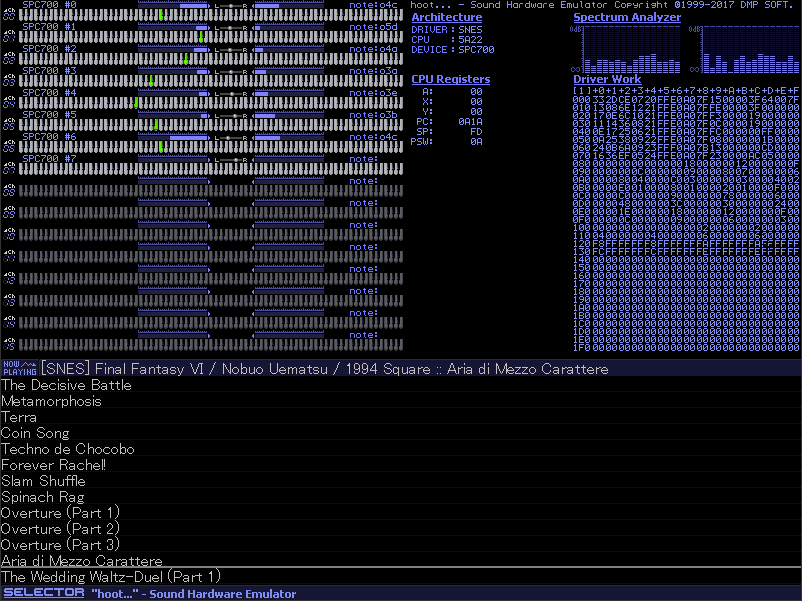

## About ##

This here is my personal <i>hoot</i> folder with my favourite video game soundtracks added in.

You can read about <i>hoot</i> here: http://vgmrips.net/wiki/Hoot

If I add any new stuff it goes to <i>xml/\~systems\~.xml</i> which is the only xml file hoot reads for soundtrack entries.

## Games List ##

Arcade

* After Burner 2
* Akuma-Jou Dracula [Haunted Castle]
* Aliens
* Armed Police Batrider
* Armed Police Unit Gallop [Cosmic Cop]
* Burning Force
* Carrier Air Wing
* Darius II
* Daytona USA
* Dragon Saber: After Story of Dragon Spirit
* E.D.F.: Earth Defense Force
* Elevator Action Returns
* Fantasy Zone
* Fantasy Zone II DX: The Tears of Opa-Opa // part of the first track
* Fighting Layer
* Final Fight
* Galaxy Force II
* Gradius III
* Magic Sword - Heroic Fantasy
* Marvel Vs. Capcom: Clash of Super Heroes
* Metal Black
* Night Slashers
* Night Striker
* Ninja Warriors, The
* OutRun
* Outfoxies, The
* Power Drift
* Quartet
* Rolling Thunder 2
* S.D.I.: Strategic Defense Initiative
* Shinobi
* Soldam
* Space Harrier
* Street Fighter Alpha 2
* Sunset Riders
* Super Contra
* Super Hang-On
* Super Monaco GP
* Super Street Fighter II: Turbo
* Teenage Mutant Ninja Turtles - Turtles in Time
* Thunder Blade
* U. N. Squadron
* X-Men
* Xexex

Gameboy

* Batman - Return of the Joker
* Castlevania - The Adventure
* Castlevania Legends
* Legend of Zelda, The - Link's Awakening
* Raging Fighter [Outburst] // some unlabeled tracks
* Super Mario Land
* Super Mario Land 2 - 6 Golden Coins
* Tetris
* Trip World

MSX Computers

* F1 Spirit -The Way to Formula-
* F1 Spirit 3D Special
* Final Fantasy
* Gekitotsu Pennant Race 2
* Illusion City [幻影都市]
* Metal Gear 2: Solid Snake
* SD Snatcher
* Salamander
* Snatcher

MegaDrive / Genesis

* Alien 3
* Alien Soldier
* Battle Mania Daiginjo
* Castlevania: Bloodlines [Vampire Killer]
* Contra: Hard Corps
* Crude Buster [Two Crude]
* Crusader of Centy
* Devilish [Bad Omen]
* Dragon's Fury [Devil Crash MD]
* Dynamite Headdy
* Gaiares
* Gauntlet IV
* Gley Lancer
* Golden Axe II
* Gunstar Heroes
* Gynoug [Wings of Wor]
* Herzog Zwei
* Hybrid Front, The
* Jewel Master
* Langrisser II
* Lethal Enforcers
* Light Crusader
* M.U.S.H.A
* Master of Monsters
* McDonald's Treasure Land Adventure
* Mega Turrican
* Midnight Resistance
* Phantasy Star II
* Ristar - The Shooting Star
* Rocket Knight Adventures
* Rolling Thunder 2
* Shinobi II: The Revenge of Shinobi
* Shinobi III: Return of the Ninja Master
* Socket [Time Dominator 1st]
* Sonic the Hedgehog
* Sonic the Hedgehog 2
* Sonic the Hedgehog 3 & Knuckles
* Sorcerian
* Space Invaders 90
* Splatterhouse 2 // see hoot.ini for correct sample rate
* Splatterhouse 3 // see hoot.ini for correct sample rate
* Star Cruiser
* Streets of Rage [Bare Knuckle]
* Streets of Rage 2 [Bare Knuckle II]
* Strider
* Super Fantasy Zone
* Sword of Vermilion
* Teenage Mutant Ninja Turtles: Tournament Fighters
* Thunder Force III
* Thunder Force IV
* Time Trax (Prototype)
* Valis III
* Valis: The Fantasm Soldier
* Verytex
* Vixen 357 // some unlabeled tracks
* Yuu Yuu Hakusho - Makyou Toitsusen

NES

* Abadox - The Deadly Inner War
* Adventures of Bayou Billy, The
* Akumajou Special - Boku Dracula-kun
* Almana no Kiseki (FDS)
* Base Wars - Cyber Stadium Series
* Batman
* Batman Returns
* Blaster Master
* Blue Marlin, The
* Castlevania
* Castlevania II - Simon's Quest
* Castlevania III - Dracula's Curse [Akumajou Densetsu]
* Chip 'n Dale Rescue Rangers
* Choujin Sentai - Jetman
* Contra
* Contra Force [Ark Hound]
* Crisis Force
* Dark Lord
* Dr. Mario
* Dragon Quest II: Luminaries of the Legendary Line
* Dragon Quest IV: Chapters of the Chosen
* Erik the Viking (Prototype)
* Esper Dream 2
* Falsion (FDS)
* Ferrari Grand Prix Challenge
* Final Fantasy II
* Final Fantasy III
* Gimmick!
* Gremlins 2 - The New Batch
* Gyruss (FDS)
* Ivan "Ironman" Stewart's Super Off Road
* Journey to Silius [RAF World]
* Just Breed
* Kick Master
* Kirby's Adventure
* Konami Hyper Soccer // unlabeled tracks
* Kunio-kun no Nekketsu Soccer League
* Lagrange Point
* Legend of Zelda 2, The - The Adventure of Link (FDS)
* Legend of Zelda, The
* Life Force [Salamander]
* Little Nemo - The Dream Master
* Magician
* Mega Man
* Mega Man 2 (VRC6)
* Mega Man 2
* Mega Man 3 (VRC6)
* Mega Man 3
* Mega Man 4 (VRC6)
* Mega Man 4
* Mega Man 5
* Megami Tensei II - Digital Devil Story
* Metroid
* Mother
* Mouryou Senki Madara
* Ninja Gaiden II - The Dark Sword of Chaos
* Ninja Gaiden III - The Ancient Ship of Doom
* Ninja Gaiden [Ninja Ryukenden]
* Pictionary
* Rollergames
* Shadow of the Ninja [Kage]
* Shatterhand [Tokkyuu Shirei - Solbrain]
* Shovel Knight
* Silver Surfer
* Solstice - The Quest for the Staff of Demons
* Super C [Super Contra]
* Super Mario Bros. 3
* Super Spy Hunter [Battle Formula]
* Teenage Mutant Ninja Turtles II - The Arcade Game
* Teenage Mutant Ninja Turtles III - The Manhattan Project
* Teenage Mutant Ninja Turtles [Gekikame Ninja Den]
* Tiny Toon Adventures
* Tom & Jerry: The Ultimate Game of Cat and Mouse!
* Trolls in Crazyland, The [Doki! Doki! Yuuenchi - Crazyland Daisakusen]
* Werewolf - The Last Warrior
* Yume Penguin Monogatari

Neo Geo

* Garou: Mark of the Wolves
* Metal Slug
* Metal Slug 2
* Metal Slug 3
* Neo Turf Masters
* Super Dodge Ball

PC Engine / TurboGrafx-16

* Aldynes - The Mission Code for Rage Crisis
* Legend of Xanadu, The [Kaze no Densetsu Xanadu]
* Legend of Xanadu II, The [Kaze no Densetsu Xanadu II]
* Magical Chase, The
* Neutopia II
* Super Star Soldier
* Susano-O Densetsu

PC-88xx

* Misty Blue
* Providence
* Scheme, The
* Shinra Bansho
* Sorcerian
* Star/Ship Rendezvous
* Wanderers from Super Scheme
* Ys I -Ancient Ys Vanished Omen-

PC-98xx

* AD&D: Death Knights of Krynn
* Advanced Power Dolls 2
* Advanced Variable Geo 2
* Akiko GOLD: The Queen of Adult // unlabeled tracks
* Anime Mahjong X // unlabeled tracks
* Area 88: Etranger 1995 // some translation missing
* Ballade for Maria // unlabeled tracks
* Black Bird: Tori Tachi no Tooboe
* Brandish
* Brandish 2 -The Planet Buster-
* Brandish 3 -Spirit of Balcan-
* Brandish VT
* Chou Jigen Densetsu Rall 3: Kakuseihen // some unlabeled tracks
* Cyber Block Metal Orange
* Desire -Spiral of Perversion-
* Don't Call Me Amy!
* Dragon Slayer: The Legend of Heroes
* Dragon Slayer: The Legend of Heroes 2
* Escalation 95: O Anesamatte Yonde Li Desu ka? // unlabeled tracks
* Eve: Burst Terror!
* FlixMix
* Grounseed // some translation needed
* If
* Illumina
* Jinmon Yuugi // unlabeled tracks
* Mahjongg Fantasia
* Mahjongg Fantasia 2 // unlabeled tracks
* Mahou Shoujo Fancy CoCo
* Mahou no Tenshi Creamy Mami: Futari no Rondo // some translation needed
* Manji: PSY Yuuki // unlabeled tracks
* Marine Rouge
* Marionette Mind
* Meikyuu Gakuensai: Kyuukousha no Nazo
* Mesuneko Hishoshitsu // unlabeled tracks
* Metal & Lace 2 [Ningyou Tsukai 2]
* Metal Force
* Miho: Momoiro Byoutou, Menkai Shazetsu!
* Miwaku no Chousho
* Night Slave
* Only You: Seiki Matsu no Juliet to Tachi
* PeroPero Candy: You no Shou // unlabeled tracks
* Popful Mail
* Possessioner
* Power Dolls
* Power Dolls 2
* Power Dolls 2 Dash
* Puyo Puyo
* Revival Xanadu
* Rhyme Star
* Rusty
* Saint Diary: Kiyoshi-chan no Nikki // translation needed
* Starfire
* Trouble Outsiders // unlabeled tracks
* Tsunyan Jaayao
* Valkyrie: The Power Beauties
* Viper CTR: Asuka
* Waku Waku Mahjong Panic 2: Koku Shimusou
* Xenon -Fantasy Body-
* YU-NO: A Girl Who Chants Love at the Bound of this World
* Yougekitai: Jashin Koumaroku
* Ys II -Ancient Ys Vanished The Final Chapter-

PC/AT

* WarCraft 2 // some unlabeled tracks

SNES

* Actraiser
* Axelay
* Bahamut Lagoon
* Brainlord
* Breath of Fire
* Castlevania: Dracula X
* Chrono Trigger
* Contra III: The Alien Wars
* Crystal Beans From Dungeon Explorer
* Cybernator [Assault Suits Valken]
* Donkey Kong Country
* Donkey Kong Country 2 - Diddy's Kong Quest
* Dragon Quest III: Soshite Densetsu he...
* Earthbound [Mother 2]
* F-Zero
* Final Fantasy V
* Final Fantasy VI
* Front Mission: Gun Hazard
* Hiouden: Mamono-tachi to no Chikai
* Honkaku Shougi: Fuuunji Ryuuou
* Hourai Gakuen no Bouken!: Tenkousei Scramble
* Ihatovo Monogatari
* Last Bible III
* Legend of Zelda, The - A Link to the Past
* Live A Live
* Mega Man & Bass [Rockman & Forte]
* Mega Man X
* Mega Man X2
* Naki no Ryuu: Mahjong Hishouden
* Ninja Warriors, The
* Ohmono Black Bass Fishing: Jinzouko Hen
* Otogirisou
* Pebble Beach Golf Links
* Pilotwings
* Plok
* Pop'n Twinbee
* Psycho Dream
* Radical Dreamers
* Secret of Mana [Seiken Densetsu 2]
* Seiken Densetsu 3
* SimCity
* Soul Blazer
* Sparkster
* Star Fox
* Super Aleste
* Super Bomberman 3
* Super Castlevania IV
* Super Ghouls 'n Ghost
* Super Mario Kart
* Super Mario World
* Super Mario World 2 - Yoshi's Island
* Super Metroid
* Super R-Type
* Sword Maniac
* Teenage Mutant Ninja Turtles: Tournament Fighters
* Treasure Hunter G
* Uncharted Waters: New Horizons
* Wagyan Paradise

X68000

* 38 Man Kilo no Kokuu
* Akiko -Premium-
* Akumajo Dracula
* Akushu
* Arcus Odyssey
* Asuka 120%: Burning Fest
* Bosconian
* Cho Ren Sha 68K
* Cosmic Psycho
* Dragon Knight 4
* Genocide 2
* Gradius II
* Granada
* Illumination Laser
* Kimi Dake ni Ai o...
* Knight Arms
* Kyuukyoku Senki Gikadiver // missing tracks
* Lam-Mal [Ranmaru] // unlabeled tracks
* Mad Stalker: Full Metal Force
* Metal Eye // some translation missing
* Nama Baseball '68 [Namachuukei 68]
* Neural Gear
* Pita Pat
* Sion II: The First Attack
* Spindizzy II
* Star Cruiser
* Star Trader
* War-Torn Versnag
* Yami no Ketsuzoku // some translation needed
* Yami no Ketsuzoku Kanketsu Hen [Final Version] // some translation needed
* Ys III -Wanderers From Ys-